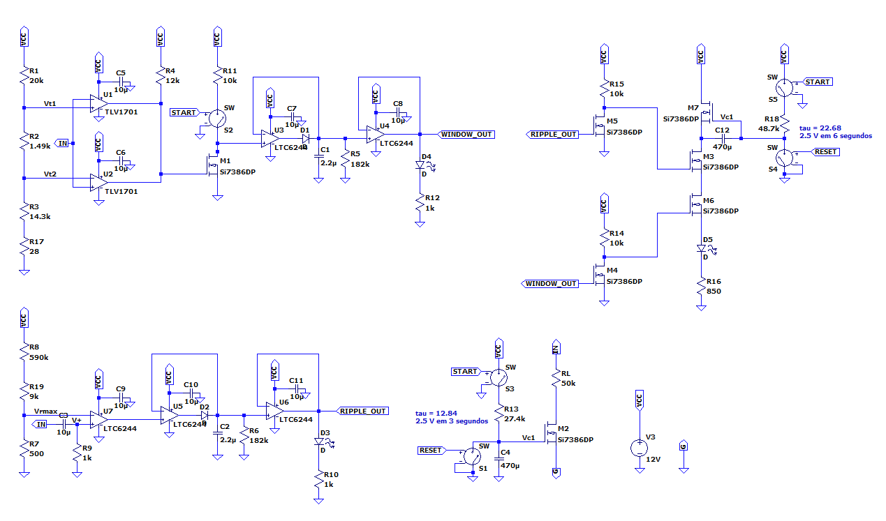
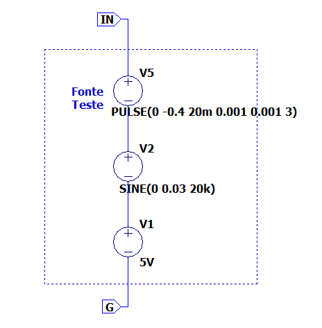
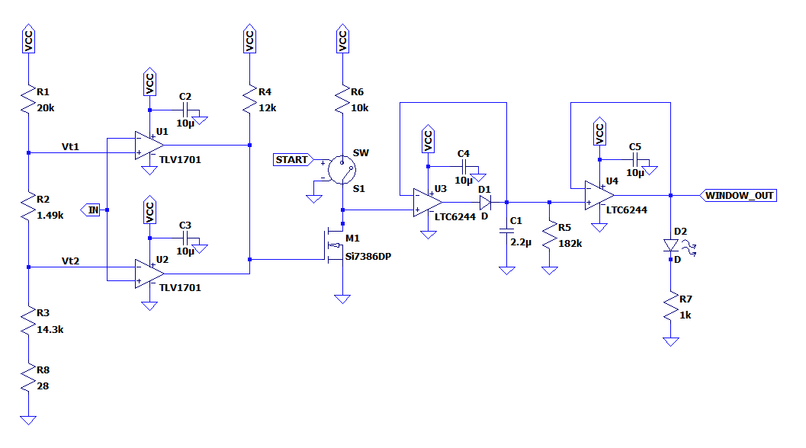
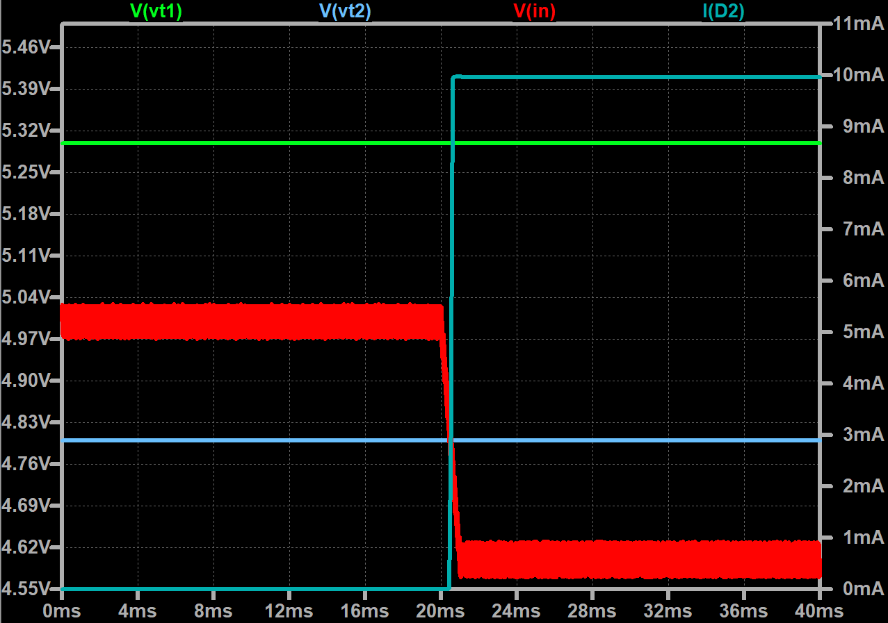
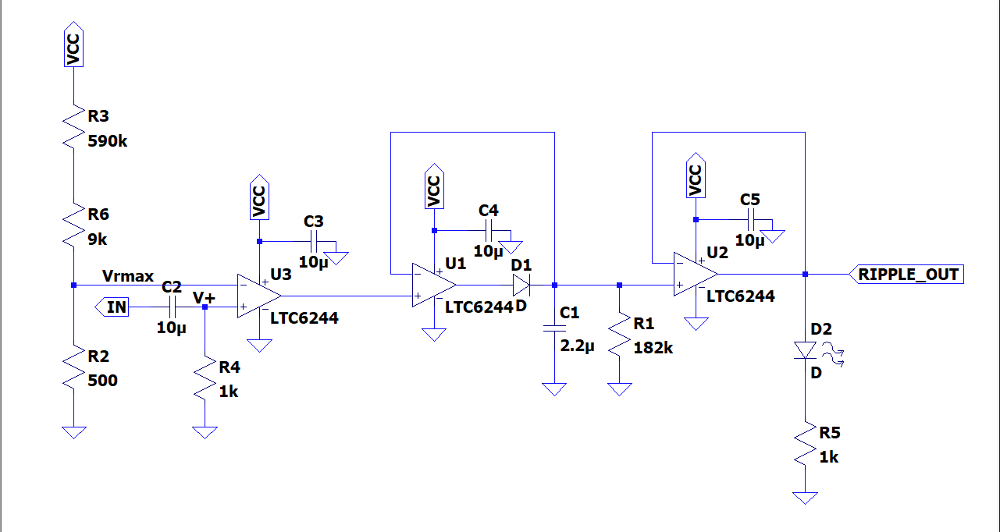
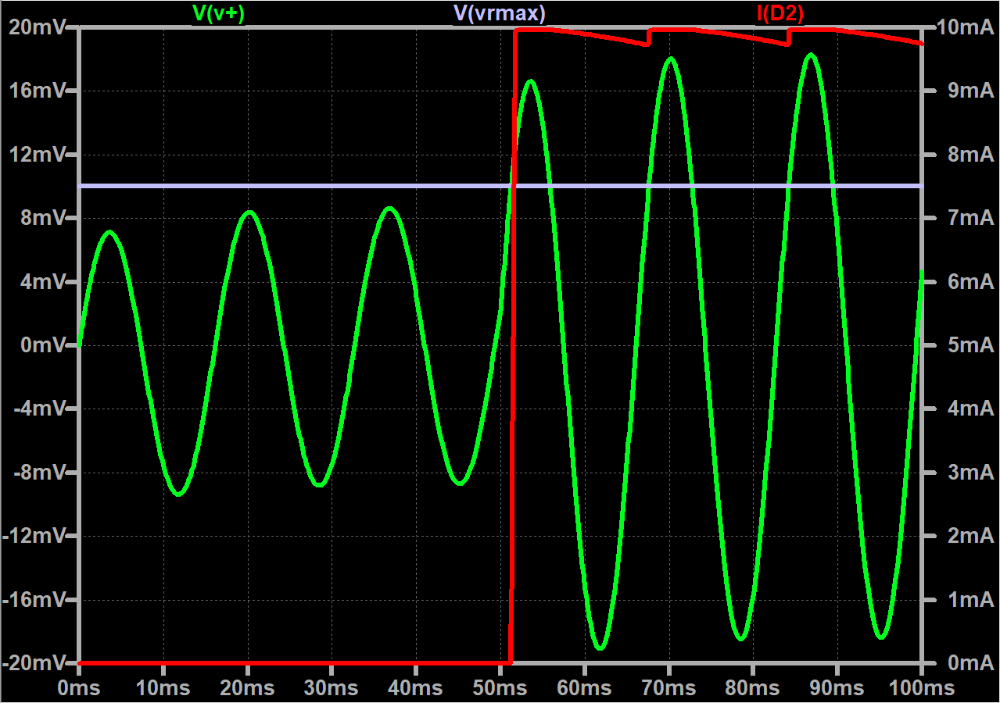

# Giga-Teste-Fontes
Giga de teste para uma fonte chaveada que testa tensão em aberto, tensão com carga e ripple de forma automatizada. Projeto exclusivamente eletrônico, usando transistores e amplificadores operacionais.

Figura 1 - Circuito completo.

No circuito exibido pela Figura 1 pode-se ver 4 seções distintas. O comparador de janela que testa tensão minima e máxima; Um comparador em conjunto com um detetor de pico que testa o ripple de tensão; O temporizador que adiciona carga a fonte depois de 3 segundos e o circuito que indica aprovação caso nenhum dos testes falhe.

   

## Simulação da fonte a ser testada
A fonte a ser testada é simulada por um componente DC que representa a tensão média, um componente AC que representa o ripple de tensão e um degrau (PULSE) que simula a queda de tensão média ao adicionar a carga. Como mostra Figura 2.

Figura 2 - Circuito que simula a fonte a ser testada.

   

## Comparador de janela
O circuito do comparador de janela é exibido pela Figura 3, que tem a função de detectar tensões maiores e menores do que o permitido, dado por dois comparadores seguido por um segurador.

Figura 3 - Circuito comparador de janela.

Na Figura 4 temos a simulação que demonstra uma fonte que falha no requisito de tensão minima quando aplicada carga, é possivel ver que o LED que indica reprovação é acendido, por meio da corrente Id.

Figura 4 - Simulação do comparador de janela.

## Detector de ripple
O circuito responsável por identificar se o ripple atende os requisitos é exibido pela Figura 5, novamente temos um comparador seguido de um segurador, porém o sinal de entrada passa por um capacitor de baixa impedância, permitindo a passagem somente do sinal AC.

Figura 5 - Circuito detector de ripple.

Simulando a condição de ripple excessivo como mostra Figura 6, vemos novamente que o LED que indica reprova é acionada quando a tensão de ripple ultrapassa o threshold.

Figura 6 - Simuação do detector de ripple.

## Relatório final
Neste README foram abordado somente os tópicos principais do projeto, o projeto completo que inclui o a escolha e dimensionamento de componentes, demais circuitos aqui não abordados e outras simulações pode ser visto <a href="Realtório final.pdf" class="image fit">aqui</a>.

